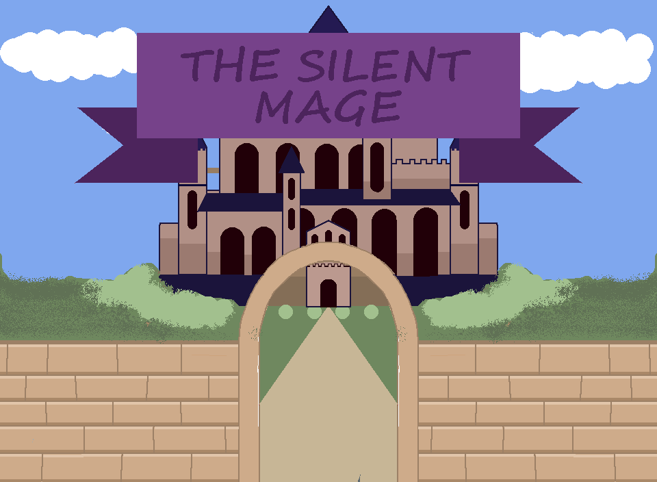
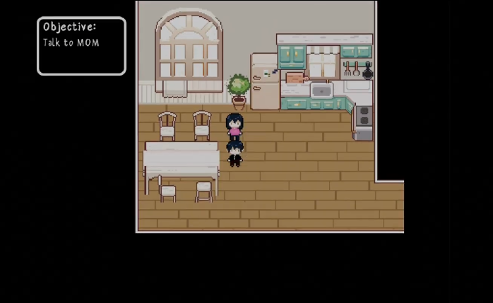
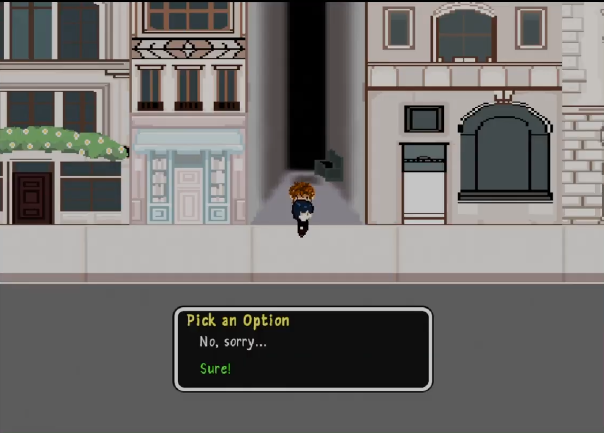
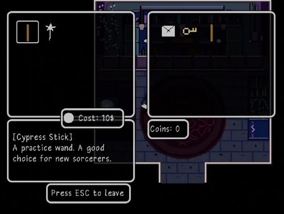
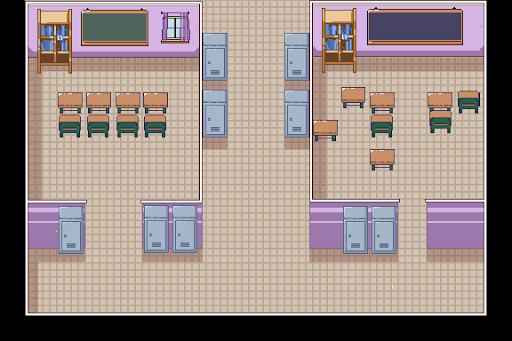

# 🧙 The Silent Mage 

## 🏰 About The Silent Mage

Created in Java using Eclipse, **The Silent Mage** explores making ethical choices and their outcomes. You play as a character born in magical world without magic, causing you to be ostracized from a community. Suddenly, you're admitted to Magical School where you embark on adventure, make new friends, and ethical decisions. Solve puzzles, endures trials, and defeat an enemy in a final battle!

## 🔮 Gameplay Preview

  
  

## ⭐ How to Run
1. Clone the repository
2. Open the project in Eclipse
3. Run `Main.java`

## 🪄 Other Info
**IDE:** Eclipse

**Language:** Java

**Artwork & Animations:** Aesprite, Piskel, and Blender

### ❤️ Huge thank you to **Sravya M and Essam S** for creating all artwork and animations!
